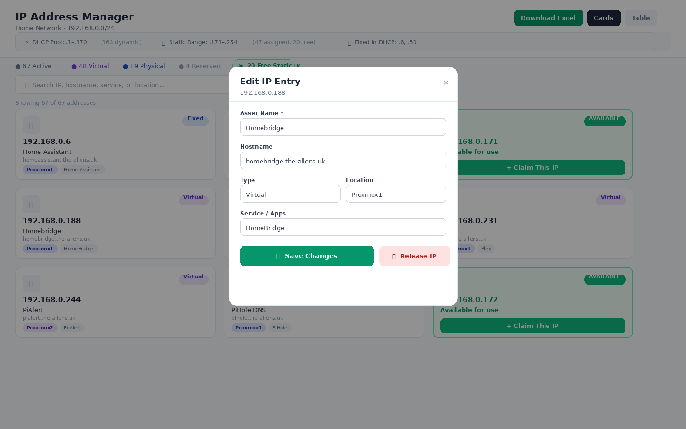

# IP Address Manager

A clean, fast web app for managing your home network's IP addresses — built to replace the Excel spreadsheet you've been using for years.

[](https://xy-io.github.io/ip-manager/)


---

## What It Does

Managing a home lab network across servers, VMs, containers, cameras, switches, and IoT devices gets complicated fast. This tool gives you a single place to:

- **Look up any IP address** instantly by name, hostname, service, location, or tag
- **See what's running** on each address — service, container type, host/hypervisor, physical location
- **Track free IPs** in your static range with one-click claiming for new servers or containers
- **Edit any entry** — change the asset name, hostname, type, location, service, tags, and notes via a clean modal form
- **Release IPs** back to the free pool when you decommission something
- **Manage multiple networks / VLANs** — add a second (or third) subnet and switch between them with tabs; each network is fully isolated
- **Full backup & restore** — download a single JSON file containing all networks, all IP entries, tags, notes, and change history; restore it on any machine in one click
- **Import from CSV / Excel** — 3-step modal with column mapping, validation, and merge or replace modes
- **Export to Excel** — downloads a fully formatted `.xlsx` preserving all your data
- **Service icons** — cards and table rows automatically display the real logo for 100+ common self-hosted services (Home Assistant, Proxmox, Sonarr, Pi-hole, Vaultwarden, Nextcloud, and many more) using the selfh.st icon library, with dark-mode variants and a Lucide fallback
- **Switch views** between Cards (visual) and Table (dense, sortable) layouts with IPs always sorted numerically
- **Keyboard shortcuts** — `/` to search, `Esc` to clear/close, `t`/`c` to switch views
- **Mobile-friendly** — toolbar collapses to a compact Tools dropdown on narrow screens; tag chips scroll horizontally
- **Configure your network** — subnet, DHCP range, static range, and DHCP reservations via the Settings panel — no code editing required
- **Ping / reachability** — live green/red status dots on every IP; auto-refreshes every 60 seconds in the background
- **Service health checks** — opt-in HTTP/HTTPS probe per entry; sky-blue dot (up) or orange dot (down) alongside the ping dot; port auto-suggest for 60+ known services; TLS errors ignored for self-signed certs

### Network-Aware

The app understands your network layout and is fully configurable via the ⚙️ Settings panel. Both **/24 and /16 networks** are supported:

| Range | Type |
|---|---|
| DHCP start – DHCP end | DHCP pool (managed by your router / DHCP server) |
| Entries in the Reservations list | Fixed DHCP reservations — can be anywhere on the network, inside or outside the DHCP pool |
| Static start – Static end | Static assignments |
| Green entries | Free — available to claim |

You can paste your full network address (e.g. `192.168.0.0` or `172.16.0.0`) and the app strips trailing zeros automatically to derive the correct prefix.

### v1.30 — Domain Tracker

New **Domains** section for tracking domain registrations. Add any domain and the app fetches registrar, expiry date, and nameservers automatically via IANA RDAP — no API keys needed, supports 1,400+ TLDs. Colour-coded expiry badges (green → amber → red) and a notification dot in the header when a renewal is coming up. Background auto-refresh every 24 hours.

### v1.29 — Security: no more default passwords

Fresh installs no longer ship with a known password. On first start the server generates a unique random password, saves it to `credentials.env`, and logs it to the service journal. The installer prints the credentials at the end of its output — one copy-paste and you're in.

If credentials ever match `admin/admin` (old installs), the API locks down and the app shows a non-dismissible password-change screen until new credentials are set.

### v1.28 — DNS resolver per network · Custom icon picker

Each network now has its own DNS reverse-lookup resolver (Settings → DNS), useful for multi-site or multi-VLAN setups where PTR records live on different nameservers.

Service icons can now be overridden per entry — open the edit modal, click **Pick icon manually**, and search the [selfh.st](https://selfh.st) library (500+ icons). Auto-detected icons still work as before.

→ Full version history: [CHANGELOG.md](./CHANGELOG.md)

---

## Screenshots

> Cards view — light mode, showing 91 IP entries with status dots, type badges, location chips, and tags.



---

## Tech Stack

| Layer | Technology |
|---|---|
| Frontend | React 18, Tailwind CSS 3, Lucide Icons |
| Build tool | Vite 5 |
| API server | Node.js + Express |
| Database | SQLite via `better-sqlite3` |
| Excel export | SheetJS (xlsx) |
| Web server | Nginx (reverse proxy + static files) |
| Runtime | Node.js 20 LTS |

---

## Installation

There are two ways to run this — locally for development, or on an LXC container on your Proxmox host for an always-on deployment.

---

### Option A — Local Development

Ideal for making changes or testing on your own machine.

**Prerequisites:** [Node.js 18+](https://nodejs.org)

```bash
# 1. Clone the repo
git clone https://github.com/xy-io/ip-manager.git
cd ip-manager

# 2. Install dependencies
npm install

# 3. Start the dev server
npm run dev
```

Open **http://localhost:5173** in your browser.

---

### Option B — LXC Container on Proxmox (Recommended)

Deploys the app as a production build served by Nginx on port 80. One script does everything.

#### Step 1 — Create the LXC container

In the Proxmox web UI:

1. Click **Create CT**
2. Use an **Ubuntu 24.04** template
3. Recommended specs:
   - CPU: 1 core
   - RAM: 512 MB
   - Disk: 4 GB
4. Give it a static IP in your static range
5. Start the container

#### Step 2 — SSH into the container

```bash
ssh root@<container-ip>
```

#### Step 3 — Run the install script

```bash
bash <(curl -fsSL https://raw.githubusercontent.com/xy-io/ip-manager/main/install.sh)
```

The script will:

1. Update apt packages
2. Install `git`, `curl`, `nginx`, and `arp-scan`
3. Install Node.js 20 LTS
4. Clone this repository to `/opt/ip-manager`
5. Run `npm install` and `npm run build`
6. Configure Nginx to serve the app on **port 80**
7. Create an `ip-manager-update` command for future updates

When it finishes, **your initial login credentials are printed at the bottom of the installer output**. Open the container's IP in your browser, sign in, and you'll be prompted to set a permanent password before you can access the app.

> **Credential recovery** — if you lose the initial password, run:
> ```
> journalctl -u ip-manager-api | grep -A5 "initial credentials"
> ```

---

## Data Persistence

The app supports two persistence modes and switches between them automatically:

| Mode | When | What it means |
|---|---|---|
| 🟢 **SQLite** | LXC/Nginx deployment | Data stored in `server/ip-manager.db` on the server — shared across all users and browsers |
| ⚪ **Local** | Local dev (`npm run dev`) | Data stored in your browser's localStorage — private to that browser |

On startup the app sends a quick health check to `/api/health`. If the API responds, it loads data from SQLite and shows the green **SQLite** badge in the header. If not, it falls back to localStorage automatically.

All saves happen automatically in both modes. The **Export** button downloads a formatted `.xlsx` of the current network. For a complete backup of all networks and all data, use **Settings → Backup & Restore → Download Full Backup** — this produces a `.json` file that can be fully restored later.

**Clearing all data:** open ⚙️ Settings → scroll to the **Danger Zone** section → Clear All Network Data. This wipes all IP entries and persists the change through the normal save path.

---

## Updating

When new code is pushed to GitHub, your stored IP data is untouched by updates.

### LXC / Nginx deployment

```bash
ip-manager-update
```

This pulls the latest code, wipes and reinstalls `node_modules` for a clean platform-native build, rebuilds the app, restarts the API service, and reloads Nginx — all in one command.

### Local development

```bash
git pull
npm install  # only needed if package.json changed
npm run dev
```

---

## Project Structure

```
ip-manager/
├── src/
│   ├── IPAddressManager.jsx   # Main React component (all logic and UI)
│   ├── main.jsx               # React entry point
│   └── index.css              # Tailwind base styles
├── server/
│   ├── index.js               # Express + SQLite API server (port 3001)
│   ├── package.json           # Server dependencies
│   ├── credentials.env        # Login credentials (edit to change username/password)
│   └── ip-manager.db          # SQLite database (created on first run)
├── public/
│   └── favicon.svg
├── index.html
├── vite.config.js
├── tailwind.config.js
├── postcss.config.js
├── package.json
├── install.sh                 # LXC one-line install script
└── IP_Manager_Roadmap.docx    # Feature roadmap
```

---

## Roadmap

**Phase 1 — foundation (shipped):**
- ✅ Tag support, sort controls, last modified date, keyboard shortcuts — shipped
- ✅ Bulk selection & bulk edit, Location management, Free IPs in main list — shipped in v1.7
- ✅ Change history / audit log — shipped in v1.7
- ✅ Multi-network / VLAN support, Full backup & restore, Hide free IP cards toggle — shipped in v1.8
- ✅ Login screen & credential management — shipped in v1.9
- ✅ Proxmox one-shot import — discover all VMs and LXCs from a Proxmox host and import in one click — shipped in v1.10
- ✅ Tag management in Settings — add, rename, delete tags; suggestions dropdown on edit modal — shipped in v1.10
- ✅ ARP network scan — one-shot subnet sweep, cross-references against manager, import untracked devices — shipped in v1.11
- ✅ DHCP toggle — disable DHCP pool per network for fully static setups — shipped in v1.11

**Phase 2 — live data & integrations (shipped):**
- ✅ **Ping / reachability** — live green/red status dots on every IP, auto-poll every 60 s, manual refresh button — shipped in v1.12
- ✅ **Help & Reference modal** — full in-app reference guide with 11 sections — shipped in v1.13
- ✅ **DNS reverse lookup** — PTR lookup for all tracked IPs, mismatch detection, configurable DNS server — shipped in v1.14
- ✅ **Proxmox scheduled sync** — background sync with HA failover detection, configurable interval, change history — shipped in v1.15
- ✅ **Multiple IPs per host** — link secondary IPs to a primary entry; chips on cards and table rows; Proxmox auto-groups multi-NIC VMs — shipped in v1.16
- ✅ **selfh.st service icons** — auto-matched logos for 100+ self-hosted services; dark-mode variants; Lucide fallback — shipped in v1.17
- ✅ **Mobile responsive UI** — collapsible Tools dropdown, scaled header, horizontal tag chips — shipped in v1.17
- ✅ **Sync result logs** — last-run result panels in Proxmox and DNS settings with per-entry diffs — shipped in v1.17
- ✅ **Service health checks** — opt-in HTTP/HTTPS probe per entry; sky-blue/orange dot alongside ping dot; 60+ service auto-suggest; TLS errors ignored — shipped in v1.18
- ✅ **Proxmox live status** — power-state badge (▶ running / ■ stopped / ⏸ paused) on Proxmox-tagged entries; reuses existing sync credentials; read-only — shipped in v1.19
- ✅ **Proxmox dedicated metadata fields** — VMID, node, kind stored separately from user notes; auto-migration on startup; read-only info panel in Edit modal; version number in Settings and Help modals — shipped in v1.20
- ✅ **In-browser updates** — version check against GitHub, live progress bar, automatic rollback on failure, release log in Settings — shipped in v1.21
- ✅ **Last seen timestamps** — opt-in; piggybacks on the existing ping cycle, zero extra traffic; clock icon + relative timestamp on cards and table; stale indicator after 25 h — shipped in v1.22
- ✅ **Background discovery scan** — opt-in scheduled ARP sweep scoped to static range; subnet-aware defaults (/24: 15 min / 1000 Kbps, /16: 60 min / 200 Kbps); user-configurable interval and bandwidth cap; untracked devices surfaced in Settings → ARP & Presence — shipped in v1.22

**Phase 3 — inventory depth & planning tools:**
- ✅ **Tools dropdown** — scalable toolbar utility menu (wrench icon); replaces ad-hoc action bar buttons — shipped in v1.23
- ✅ **CIDR calculator** — enter any CIDR block, get back usable range, broadcast address, host count, wildcard mask, and binary representation; entirely client-side — shipped in v1.23
- ✅ **QR codes** — generate a QR code for any entry's management URL or bare IP; toggle encode target, download as PNG or copy to clipboard — shipped in v1.23
- ✅ **MAC address + vendor lookup** — optional MAC address field per entry; auto-resolves manufacturer from bundled IEEE OUI database (no internet required); displayed on cards and in table — shipped in v1.24
- ✅ **SSH / HTTP quick-launch** — one-click HTTP/HTTPS and SSH buttons on expanded cards; HTTP/HTTPS uses the service health check config; SSH opens via OS handler — shipped in v1.24
- ✅ **Subnet Visualiser + Planned Blocks** — 16×16 heat-map grid of the full address space; colour-coded free/static/DHCP/reserved cells with row labels and usage summary; overlay named planned blocks (e.g. "IoT .200–.220") stored per network — shipped in v1.24
- ✅ **Two-zone header + app logo** — Subnet Grid logo; left identity zone (logo, network pill/switcher) and right actions zone (Import, Export, unified Tools menu); standalone Proxmox/ARP Scan/Ping/DNS buttons consolidated into Tools; SQLite badge and view toggle move to a quiet sub-bar — shipped in v1.25
- ✅ **Scheduled cloud backup** — GUI-configured backup to S3-compatible storage, SFTP, local paths, Dropbox, or Google Drive (via rclone); daily/weekly schedule; configurable retention; manual trigger; no cron setup required — shipped in v1.26
- ✅ **Dependency mapping** — link entries to the devices they depend on; a red "dep offline" badge appears on the card when any dependency goes down (ping or health check); expanded card shows the full dependency list with live status dots — shipped in v1.27
- **Per-entry audit log** (v1.27) — drill down from any card into the full change history for that specific entry; filters the existing global audit log by IP
- **Bulk add from Proxmox sync** (v1.28) — opt-in toggle to auto-add newly discovered Proxmox VMs/LXCs rather than only updating existing entries
- **Custom fields** (v1.28) — user-definable key/value pairs per entry (e.g. "Serial number", "VLAN ID", "Purchase date"); searchable and importable via CSV
- **Entry templates** (v1.29) — pre-define common entry configurations (type, location, tags, health port) in Settings; apply a template when claiming a new IP to skip repetitive form filling
- **Topology view** (v1.29) — interactive graph derived from existing relationships (Proxmox host → VMs/LXCs, primary → secondary IPs, dependency links); no manual wiring required

**Phase 4 — longer-term:**
- **Multi-user auth** — per-user accounts with role-based access (read-only vs admin)
- **iOS native app** — native iPhone/iPad app for at-a-glance network status and quick IP lookups on the go
- REST API for external integrations

---

## Network Configuration

No code editing required. Click the **⚙️ Settings** icon in the app header to configure:

| Setting | Description |
|---|---|
| Network name | Display name shown in the header and network tabs |
| Subnet | Your network prefix — paste the full address (`192.168.0.0`) or just the prefix (`192.168.1` for /24, `192.168` for /16). Trailing zeros are stripped automatically. |
| DHCP enabled | Toggle the DHCP pool on or off. Disable for networks where everything is statically assigned. |
| DHCP range | Start and end of the DHCP pool (single octets for /24, e.g. `1`/`170`; two octets for /16, e.g. `2.20`/`2.250`). Hidden when DHCP is disabled. |
| DHCP Reservations | Host portions of IPs with DHCP reservations — can be anywhere on the network, not just within the DHCP pool. Hidden when DHCP is disabled. |
| Static range | Start and end of your static assignments |
| Locations | Add, rename, or remove physical location labels for the active network |
| Display | Toggle whether free IP cards appear in the main list (turn off for large /16 networks) |
| Backup & Restore | Download a full `.json` backup or restore from a previous backup |
| Account | Change the login username and password without touching the server |
| Delete Network | Removes the active network and all its IP entries (shown only when multiple networks exist) |

Settings are saved automatically and persist across sessions.

---

## Proxmox Integration

The purple **Proxmox** button in the app header lets you discover all VMs and LXC containers from a Proxmox host and import them in one click. It requires a Proxmox API token — here's how to set one up.

### Step 1 — Create the API token

1. Open your Proxmox web UI and go to **Datacenter → Permissions → API Tokens**
2. Click **Add**
3. Set **User** to `root@pam` (or any Proxmox user with read access)
4. Set **Token ID** to something memorable, e.g. `ipmanager`
5. Leave **Privilege Separation** _unchecked_ — this lets the token inherit the user's full permissions without needing extra role assignments
6. Click **Add** — **copy the token secret immediately**; it will not be shown again

> **If you left Privilege Separation checked** you need to assign a role manually: go to **Datacenter → Permissions → Add → API Token Permission**, set Path to `/`, select your token, and set Role to **PVEAuditor**.

### Step 2 — Note the token format

The token string follows this pattern:

```
USER@REALM!TOKENID=SECRET-UUID
```

Example:

```
root@pam!ipmanager=xxxxxxxx-xxxx-xxxx-xxxx-xxxxxxxxxxxx
```

Paste this full string into the **API Token** field in the import modal.

### Step 3 — Run the import

1. Click the purple **Proxmox** button in the app header
2. Enter your Proxmox host IP or hostname (port defaults to 8006)
3. Paste the API token
4. Leave **Ignore TLS certificate errors** checked if you're using a self-signed cert (the default for most home lab setups)
5. Click **Discover VMs & LXCs** — the app queries the Proxmox API and lists all containers and VMs with IP addresses
6. Review the results, select the entries you want, choose **Merge** or **Replace**, and click **Import**

### Troubleshooting

| Symptom | Cause | Fix |
|---|---|---|
| "401 Unauthorized" | Wrong token string or token was deleted | Re-create the token and copy the full `USER@REALM!TOKENID=SECRET` string |
| VM has no IP in results | QEMU guest agent not running inside the VM | Install and enable `qemu-guest-agent` inside the VM, then restart it |
| LXC has no IP | Container is stopped | Start the container — stopped LXCs don't report network interfaces |
| "certificate verify failed" | Self-signed TLS cert on Proxmox | Enable **Ignore TLS certificate errors** in the modal |
| Connection refused | Wrong host/port or firewall | Verify the IP and that port 8006 is reachable from the IP manager's LXC |

---

## Importing Your IP Data

Click the **Import** button in the app header to load your own data from a `.csv`, `.xlsx`, or `.xls` file. The import flow is three steps:

**Step 1 — Upload**
Drag and drop a file onto the upload zone, or click to browse. A downloadable CSV template with the correct headers is available if you're starting from scratch.

**Step 2 — Map Columns**
The importer auto-detects common column name variations (e.g. `hostname`, `host name`, `fqdn` all map to Hostname automatically). If your headers aren't recognised, use the dropdowns to match each field manually.

**Step 3 — Confirm & Import**
A summary shows how many rows are ready to import and how many were skipped (with reasons). Choose your import mode:

| Mode | Behaviour |
|---|---|
| **Merge** | Adds new entries; updates existing ones matched by IP address. Existing entries not in the file are left untouched. |
| **Replace** | Replaces all current data with the imported rows. Use with caution. |

**Supported columns**

| Column | Required | Notes |
|---|---|---|
| `ip` | ✅ | Full IPv4 (`192.168.0.10`). On /24 networks, last-octet shorthand (`10`) is expanded to your subnet automatically. |
| `hostname` | ✅ | FQDN or short name |
| `type` | ✅ | e.g. `LXC`, `VM`, `Physical`, `IoT` |
| `service` | ✅ | App or service running on the host |
| `name` | — | Display / asset name (falls back to hostname prefix if omitted) |
| `location` | — | Physical location or rack |
| `host` | — | Hypervisor or host machine |
| `notes` | — | Free-text notes |
| `status` | — | `assigned` or `free` (defaults to `assigned`) |

---

## License

© 2026 Jay Allen — free for personal and non-commercial use under the [PolyForm Noncommercial License 1.0.0](./LICENSE). Commercial use is not permitted without explicit permission.
