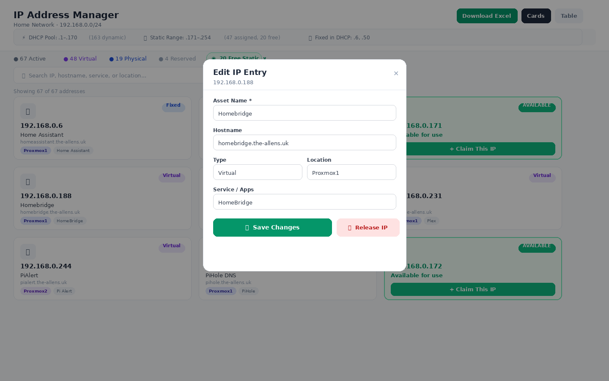

# IP Address Manager

A clean, fast web app for managing your home network's IP addresses — built to replace the Excel spreadsheet you've been using for years.

[](https://xy-io.github.io/ip-manager/)


---

## What It Does

Managing a home lab network across servers, VMs, containers, cameras, switches, and IoT devices gets complicated fast. This tool gives you a single place to:

- **Look up any IP address** instantly by name, hostname, service, location, or tag
- **See what's running** on each address — service, container type, host/hypervisor, physical location
- **Track free IPs** in your static range with one-click claiming for new servers or containers
- **Edit any entry** — change the asset name, hostname, type, location, service, tags, and notes via a clean modal form
- **Release IPs** back to the free pool when you decommission something
- **Manage multiple networks / VLANs** — add a second (or third) subnet and switch between them with tabs; each network is fully isolated
- **Full backup & restore** — download a single JSON file containing all networks, all IP entries, tags, notes, and change history; restore it on any machine in one click
- **Import from CSV / Excel** — 3-step modal with column mapping, validation, and merge or replace modes
- **Export to Excel** — downloads a fully formatted `.xlsx` preserving all your data
- **Service icons** — cards and table rows automatically display the real logo for 100+ common self-hosted services (Home Assistant, Proxmox, Sonarr, Pi-hole, Vaultwarden, Nextcloud, and many more) using the selfh.st icon library, with dark-mode variants and a Lucide fallback
- **Switch views** between Cards (visual) and Table (dense, sortable) layouts with IPs always sorted numerically
- **Keyboard shortcuts** — `/` to search, `Esc` to clear/close, `t`/`c` to switch views
- **Mobile-friendly** — toolbar collapses to a compact Tools dropdown on narrow screens; tag chips scroll horizontally
- **Configure your network** — subnet, DHCP range, static range, and DHCP reservations via the Settings panel — no code editing required
- **Ping / reachability** — live green/red status dots on every IP; auto-refreshes every 60 seconds in the background
- **Service health checks** — opt-in HTTP/HTTPS probe per entry; sky-blue dot (up) or orange dot (down) alongside the ping dot; port auto-suggest for 60+ known services; TLS errors ignored for self-signed certs

### Network-Aware

The app understands your network layout and is fully configurable via the ⚙️ Settings panel. Both **/24 and /16 networks** are supported:

| Range | Type |
|---|---|
| DHCP start – DHCP end | DHCP pool (managed by your router / DHCP server) |
| Entries in the Reservations list | Fixed DHCP reservations — can be anywhere on the network, inside or outside the DHCP pool |
| Static start – Static end | Static assignments |
| Green entries | Free — available to claim |

You can paste your full network address (e.g. `192.168.0.0` or `172.16.0.0`) and the app strips trailing zeros automatically to derive the correct prefix.

### v2.5.0 — Server code split

Infrastructure only, with no functional change. `server/index.js` is down from 3,325 to ~2,350 lines, with credentials, sessions, API keys, the event system, the database layer and the Domain Tracker and backup routes moved into `server/lib/` and `server/routes/`. Verified by diffing the full 102-check smoke suite against a pre-refactor baseline after every extraction step — identical results throughout. The process caught two path bugs that would have relocated `credentials.env` and `rclone.conf`, the first of which would have locked users out on upgrade.

### v2.4.0 — Security hardening and correctness fixes

Closes two command-injection paths: `subnet` was interpolated into a shell string for `arp-scan`, and the rclone backup password was quoted with `JSON.stringify` (which is not shell quoting). Both now use `execFile` with argument arrays plus strict validation. The support bundle redacts credentials before writing, so a bundle from a fresh install no longer contains the generated startup password. Adds login rate limiting (ten failures per address per fifteen minutes, checked before bcrypt runs) and sliding-window session expiry. Fixes three real bugs: the IP list not refreshing after a Proxmox sync, the wrong card expanding after a sort or status poll, and saves echoing freshly-loaded server state straight back — which could overwrite a concurrent sync.

### v2.3.0 — Full API-key compatibility for native clients

Fixes a significant bug: around 48 routes applied `requireAuth` directly and only accepted session cookies, so API keys were rejected on Domains, Ping, Service Health, ARP, DNS and Proxmox despite passing the middleware. Every endpoint now accepts `X-API-Key` with no cookie. Adds structured `{error, message}` JSON on every failure with correct `401`/`403`/`409` semantics, a `GET /api/capabilities` feature map, and Unix-seconds timestamps on the status endpoints (they were milliseconds, which would have made a client's refresh scheduling wrong by a factor of a thousand). The Proxmox API token is no longer returned to API keys. Smoke tests now run 99 checks including a full dashboard sweep using only a key.

### v2.2.0 — Notifications, activity log, and accessibility

Push alerts to [ntfy](https://ntfy.sh) or any webhook when a device goes offline, a health check fails, a domain nears expiry, or a backup fails — configured in **Settings → Notifications**, with a test button and per-event toggles. Offline alerts wait for a configurable number of consecutive failed ping cycles so a single dropped packet doesn't wake you, and fire once rather than repeatedly. Adds an **Activity** log recording sign-ins (including failures), API key changes, config updates and entry edits — the last 500 events, filterable. Both are session-only, so an API key can't read the log or repoint notifications. Plus a full accessibility pass: dialog semantics and focus management on all eleven modals, accessible names on icon buttons, and keyboard-operable IP cards.

### v2.1.0 — Public API with named access keys

External clients authenticate with their own API key instead of your password. Create one per client in **Settings → API Keys**, each labelled and scoped `read only` or `read & write`; revoking one leaves the others working. Your existing Home Assistant key is migrated automatically as a read-only key — nothing to change. Adds per-entry endpoints (`POST /api/ips`, `PATCH`/`DELETE`/`GET /api/ips/:ip`) so a client can edit one device without rewriting the dataset, with optional `expectedLastModified` conflict detection. Keys are refused on account and maintenance routes regardless of scope, and writes must use the `X-API-Key` header rather than a query parameter. Full reference in the [API wiki page](https://github.com/xy-io/ip-manager/wiki/API).

### v2.0.2 — Security fix & Home Assistant status fix

`/api/proxmox/discover` was reachable without authentication — it sat above the auth middleware, so anyone able to reach the server could ask it to connect to an arbitrary host. Now fixed. Separately, the Home Assistant API had reported every device as `unknown` since it shipped in v1.33.0: the ping cache stores `up`/`down` while the endpoints compared against `alive`/`unreachable`. Both now share one translation helper. **If you have Home Assistant automations built on these sensors, they will start reporting real values.** Also adds `scripts/smoke-test.cjs` — see [Testing](#testing) — which is how both defects were found.

### v2.0.1 — Hotfix: bcrypt hash detection

`bcryptjs` produces `$2a$`-prefixed hashes, but v2.0.0 only recognised `$2b$` — so the migration treated an existing hash as plaintext and re-hashed it on every login attempt, locking users out. Fixed, plus automatic recovery: a double-hashed password is now detected on startup and replaced with fresh credentials logged to the service journal. **If you are stuck on v2.0.0**, run `ip-manager-update` and retrieve the new credentials with `journalctl -u ip-manager-api | grep -A5 "double-hash recovery"`.

### v2.0 — Bcrypt password hashing

Passwords are no longer stored in plaintext. From v2.0.0 `credentials.env` holds a bcrypt hash (cost factor 12) — even with read access to the file, the password cannot be recovered. **Existing users are migrated automatically on first restart after upgrading** — no action needed, same login credentials as before. First-run generated passwords are hashed before being written to disk; the plaintext is only ever shown once in the service journal. See [ROADMAP.md](./ROADMAP.md) for what's coming next, including passkey support.

### v1.33 — Home Assistant JSON API

New read-only REST API for pulling network data into Home Assistant or any automation platform. Three endpoints: `/api/ha/summary` (device counts and domain expiry stats), `/api/ha/devices` (per-device ping and health status), `/api/ha/domains` (expiry dates and urgency status). Authenticated by a dedicated API key generated in **Settings → Home Assistant** — independent of your login credentials and revokable at any time.

### v1.32 — SSH username per entry

The SSH quick-launch button now supports a per-entry username. Set it in the edit modal (e.g. `root` for Proxmox, `admin` for a router) and the button opens `ssh://user@hostname`. A live preview shows the exact URL before saving.

### v1.31 — Domain Tracker: RDAP fixes and UI refresh

Fixed registrar names showing as numeric IANA IDs — the parser now reads the human-readable name from the vCard data. Fixed RDAP lookups for `.online`, `.watch`, `.pro` and other TLDs whose servers issue HTTP redirects; these now resolve correctly. Nameservers normalised to lowercase. Domain cards refreshed with colour-coded left borders, expiry date shown alongside the days badge, registrar as a hyperlink, and a cleaner error state.

### v1.30 — Domain Tracker

New **Domains** section for tracking domain registrations. Add any domain and the app fetches registrar, expiry date, and nameservers automatically via IANA RDAP — no API keys needed, supports 1,400+ TLDs. Colour-coded expiry badges (green → amber → red) and a notification dot in the header when a renewal is coming up. Background auto-refresh every 24 hours.

### v1.29 — Security: no more default passwords

Fresh installs no longer ship with a known password. On first start the server generates a unique random password, saves it to `credentials.env`, and logs it to the service journal. The installer prints the credentials at the end of its output — one copy-paste and you're in.

If credentials ever match `admin/admin` (old installs), the API locks down and the app shows a non-dismissible password-change screen until new credentials are set.

### v1.28 — DNS resolver per network · Custom icon picker

Each network now has its own DNS reverse-lookup resolver (Settings → DNS), useful for multi-site or multi-VLAN setups where PTR records live on different nameservers.

Service icons can now be overridden per entry — open the edit modal, click **Pick icon manually**, and search the [selfh.st](https://selfh.st) library (500+ icons). Auto-detected icons still work as before.

→ Full version history: [CHANGELOG.md](./CHANGELOG.md)

---

## Screenshots

> Cards view — light mode, showing 91 IP entries with status dots, type badges, location chips, and tags.



---

## Tech Stack

| Layer | Technology |
|---|---|
| Frontend | React 18, Tailwind CSS 3, Lucide Icons |
| Build tool | Vite 5 |
| API server | Node.js + Express |
| Database | SQLite via `better-sqlite3` |
| Excel export | SheetJS (xlsx) |
| Web server | Nginx (reverse proxy + static files) |
| Runtime | Node.js 20 LTS |

---

## Installation

There are two ways to run this — locally for development, or on an LXC container on your Proxmox host for an always-on deployment.

---

### Option A — Local Development

Ideal for making changes or testing on your own machine.

**Prerequisites:** [Node.js 18+](https://nodejs.org)

```bash
# 1. Clone the repo
git clone https://github.com/xy-io/ip-manager.git
cd ip-manager

# 2. Install dependencies
npm install

# 3. Start the dev server
npm run dev
```

Open **http://localhost:5173** in your browser.

---

### Option B — LXC Container on Proxmox (Recommended)

Deploys the app as a production build served by Nginx on port 80. One script does everything.

#### Step 1 — Create the LXC container

In the Proxmox web UI:

1. Click **Create CT**
2. Use an **Ubuntu 24.04** template
3. Recommended specs:
   - CPU: 1 core
   - RAM: 512 MB
   - Disk: 4 GB
4. Give it a static IP in your static range
5. Start the container

#### Step 2 — SSH into the container

```bash
ssh root@<container-ip>
```

#### Step 3 — Run the install script

```bash
bash <(curl -fsSL https://raw.githubusercontent.com/xy-io/ip-manager/main/install.sh)
```

The script will:

1. Update apt packages
2. Install `git`, `curl`, `nginx`, and `arp-scan`
3. Install Node.js 20 LTS
4. Clone this repository to `/opt/ip-manager`
5. Run `npm install` and `npm run build`
6. Configure Nginx to serve the app on **port 80**
7. Create an `ip-manager-update` command for future updates

When it finishes, **your initial login credentials are printed at the bottom of the installer output**. Open the container's IP in your browser, sign in, and you'll be prompted to set a permanent password before you can access the app.

> **Credential recovery** — if you lose the initial password, run:
> ```
> journalctl -u ip-manager-api | grep -A5 "initial credentials"
> ```

---

## Data Persistence

The app supports two persistence modes and switches between them automatically:

| Mode | When | What it means |
|---|---|---|
| 🟢 **SQLite** | LXC/Nginx deployment | Data stored in `server/ip-manager.db` on the server — shared across all users and browsers |
| ⚪ **Local** | Local dev (`npm run dev`) | Data stored in your browser's localStorage — private to that browser |

On startup the app sends a quick health check to `/api/health`. If the API responds, it loads data from SQLite and shows the green **SQLite** badge in the header. If not, it falls back to localStorage automatically.

All saves happen automatically in both modes. The **Export** button downloads a formatted `.xlsx` of the current network. For a complete backup of all networks and all data, use **Settings → Backup & Restore → Download Full Backup** — this produces a `.json` file that can be fully restored later.

**Clearing all data:** open ⚙️ Settings → scroll to the **Danger Zone** section → Clear All Network Data. This wipes all IP entries and persists the change through the normal save path.

---

## Updating

When new code is pushed to GitHub, your stored IP data is untouched by updates.

### LXC / Nginx deployment

```bash
ip-manager-update
```

This pulls the latest code, wipes and reinstalls `node_modules` for a clean platform-native build, rebuilds the app, restarts the API service, and reloads Nginx — all in one command.

### Local development

```bash
git pull
npm install  # only needed if package.json changed
npm run dev
```

---

## Project Structure

```
ip-manager/
├── src/
│   ├── IPAddressManager.jsx   # Main React component (all logic and UI)
│   ├── main.jsx               # React entry point
│   └── index.css              # Tailwind base styles
├── server/
│   ├── index.js               # Express + SQLite API server (port 3001)
│   ├── package.json           # Server dependencies
│   ├── credentials.env        # Login credentials (edit to change username/password)
│   └── ip-manager.db          # SQLite database (created on first run)
├── public/
│   └── favicon.svg
├── scripts/
│   ├── update.sh              # Update logic (run via ip-manager-update)
│   └── smoke-test.cjs         # End-to-end verification (see Testing below)
├── index.html
├── vite.config.js
├── tailwind.config.js
├── postcss.config.js
├── package.json
├── install.sh                 # LXC one-line install script
└── IP_Manager_Roadmap.docx    # Feature roadmap
```

---

## Testing

`scripts/smoke-test.cjs` verifies a running install end-to-end: authentication, every API route's status code and response shape, the ping and health caches, the Home Assistant API, and a set of known security regressions. It is **read-only** — it makes no writes and mutates no data, so it is safe to run against a live server.

Run it from the repo root on the server:

```bash
SMOKE_USER=yourname SMOKE_PASS='yourpassword' node scripts/smoke-test.cjs
```

Optional:

| Variable / flag | Purpose |
|---|---|
| `SMOKE_HA_KEY` | Home Assistant API key — enables the HA endpoint tests (skipped without it) |
| `--url <base>` | Target a different host (default `http://127.0.0.1:3001`) |
| `--build` | Also run `npm run build` and fail if the frontend build breaks |
| `--verbose` | Print response bodies for failing checks |

Exit code is `0` when everything passes and `1` on any failure, so it can gate a deployment:

```bash
node scripts/smoke-test.cjs --build && ip-manager-update
```

**Run it before and after any update** — particularly before asking anyone else to update. Comparing the two runs is the quickest way to catch a regression before it reaches a user.

---

## Roadmap

Planned work and ideas under consideration live in **[ROADMAP.md](./ROADMAP.md)**. The full history of what has shipped is in **[CHANGELOG.md](./CHANGELOG.md)**.

Currently next up:

- Remaining security hardening — argument-safe shell invocation, support-bundle redaction, login rate limiting, session expiry
- Correctness fixes — Proxmox sync refresh, card expansion state, and a read-modify-write race on save
- Performance — memoised list rows and virtualisation for large networks
- Then: outbound webhooks / ntfy notifications, an audit log, and an iOS client built on the v2.1 API

---

## Network Configuration

No code editing required. Click the **⚙️ Settings** icon in the app header to configure:

| Setting | Description |
|---|---|
| Network name | Display name shown in the header and network tabs |
| Subnet | Your network prefix — paste the full address (`192.168.0.0`) or just the prefix (`192.168.1` for /24, `192.168` for /16). Trailing zeros are stripped automatically. |
| DHCP enabled | Toggle the DHCP pool on or off. Disable for networks where everything is statically assigned. |
| DHCP range | Start and end of the DHCP pool (single octets for /24, e.g. `1`/`170`; two octets for /16, e.g. `2.20`/`2.250`). Hidden when DHCP is disabled. |
| DHCP Reservations | Host portions of IPs with DHCP reservations — can be anywhere on the network, not just within the DHCP pool. Hidden when DHCP is disabled. |
| Static range | Start and end of your static assignments |
| Locations | Add, rename, or remove physical location labels for the active network |
| Display | Toggle whether free IP cards appear in the main list (turn off for large /16 networks) |
| Backup & Restore | Download a full `.json` backup or restore from a previous backup |
| Account | Change the login username and password without touching the server |
| Delete Network | Removes the active network and all its IP entries (shown only when multiple networks exist) |

Settings are saved automatically and persist across sessions.

---

## Proxmox Integration

The purple **Proxmox** button in the app header lets you discover all VMs and LXC containers from a Proxmox host and import them in one click. It requires a Proxmox API token — here's how to set one up.

### Step 1 — Create the API token

1. Open your Proxmox web UI and go to **Datacenter → Permissions → API Tokens**
2. Click **Add**
3. Set **User** to `root@pam` (or any Proxmox user with read access)
4. Set **Token ID** to something memorable, e.g. `ipmanager`
5. Leave **Privilege Separation** _unchecked_ — this lets the token inherit the user's full permissions without needing extra role assignments
6. Click **Add** — **copy the token secret immediately**; it will not be shown again

> **If you left Privilege Separation checked** you need to assign a role manually: go to **Datacenter → Permissions → Add → API Token Permission**, set Path to `/`, select your token, and set Role to **PVEAuditor**.

### Step 2 — Note the token format

The token string follows this pattern:

```
USER@REALM!TOKENID=SECRET-UUID
```

Example:

```
root@pam!ipmanager=xxxxxxxx-xxxx-xxxx-xxxx-xxxxxxxxxxxx
```

Paste this full string into the **API Token** field in the import modal.

### Step 3 — Run the import

1. Click the purple **Proxmox** button in the app header
2. Enter your Proxmox host IP or hostname (port defaults to 8006)
3. Paste the API token
4. Leave **Ignore TLS certificate errors** checked if you're using a self-signed cert (the default for most home lab setups)
5. Click **Discover VMs & LXCs** — the app queries the Proxmox API and lists all containers and VMs with IP addresses
6. Review the results, select the entries you want, choose **Merge** or **Replace**, and click **Import**

### Troubleshooting

| Symptom | Cause | Fix |
|---|---|---|
| "401 Unauthorized" | Wrong token string or token was deleted | Re-create the token and copy the full `USER@REALM!TOKENID=SECRET` string |
| VM has no IP in results | QEMU guest agent not running inside the VM | Install and enable `qemu-guest-agent` inside the VM, then restart it |
| LXC has no IP | Container is stopped | Start the container — stopped LXCs don't report network interfaces |
| "certificate verify failed" | Self-signed TLS cert on Proxmox | Enable **Ignore TLS certificate errors** in the modal |
| Connection refused | Wrong host/port or firewall | Verify the IP and that port 8006 is reachable from the IP manager's LXC |

---

## Importing Your IP Data

Click the **Import** button in the app header to load your own data from a `.csv`, `.xlsx`, or `.xls` file. The import flow is three steps:

**Step 1 — Upload**
Drag and drop a file onto the upload zone, or click to browse. A downloadable CSV template with the correct headers is available if you're starting from scratch.

**Step 2 — Map Columns**
The importer auto-detects common column name variations (e.g. `hostname`, `host name`, `fqdn` all map to Hostname automatically). If your headers aren't recognised, use the dropdowns to match each field manually.

**Step 3 — Confirm & Import**
A summary shows how many rows are ready to import and how many were skipped (with reasons). Choose your import mode:

| Mode | Behaviour |
|---|---|
| **Merge** | Adds new entries; updates existing ones matched by IP address. Existing entries not in the file are left untouched. |
| **Replace** | Replaces all current data with the imported rows. Use with caution. |

**Supported columns**

| Column | Required | Notes |
|---|---|---|
| `ip` | ✅ | Full IPv4 (`192.168.0.10`). On /24 networks, last-octet shorthand (`10`) is expanded to your subnet automatically. |
| `hostname` | ✅ | FQDN or short name |
| `type` | ✅ | e.g. `LXC`, `VM`, `Physical`, `IoT` |
| `service` | ✅ | App or service running on the host |
| `name` | — | Display / asset name (falls back to hostname prefix if omitted) |
| `location` | — | Physical location or rack |
| `host` | — | Hypervisor or host machine |
| `notes` | — | Free-text notes |
| `status` | — | `assigned` or `free` (defaults to `assigned`) |

---

## License

© 2026 Jay Allen — free for personal and non-commercial use under the [PolyForm Noncommercial License 1.0.0](./LICENSE). Commercial use is not permitted without explicit permission.
